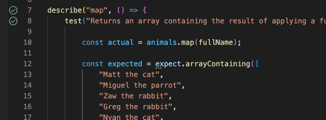

# Running the tests in VSCode

From the terminal run:
```
npm install
```

Install the Jest extension for VSCode:
https://marketplace.visualstudio.com/items?itemName=Orta.vscode-jest

> NB: You may need to restart VSCode before the green arrows appear for you

Click the green arrow next to the test you want to run:



# FAQ

## When running tests "SyntaxError: Cannot use import statement outside a module"

You need to set `--experimental-vm-modules` in your `NODE_OPTIONS` when running Jest.

```

    Details:

    /Users/matt/dev/oss/cyf-mentee-reference/arrays/map.test.js:1
    ({"Object.<anonymous>":function(module,exports,require,__dirname,__filename,jest){import {animals} from "./animals.js";
                                                                                      ^^^^^^

    SyntaxError: Cannot use import statement outside a module
```
